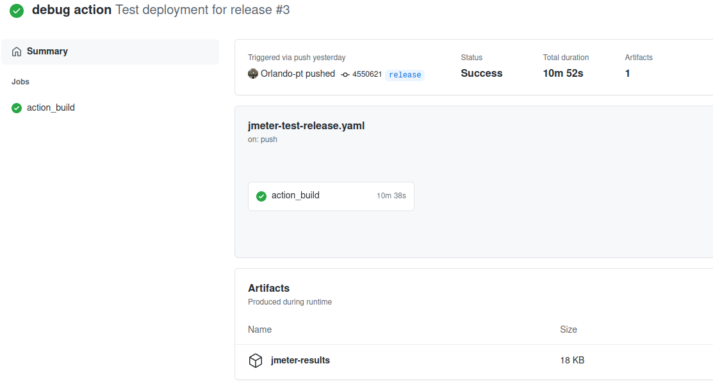
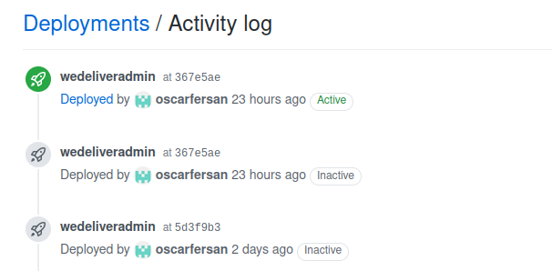
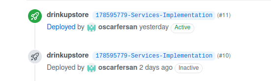
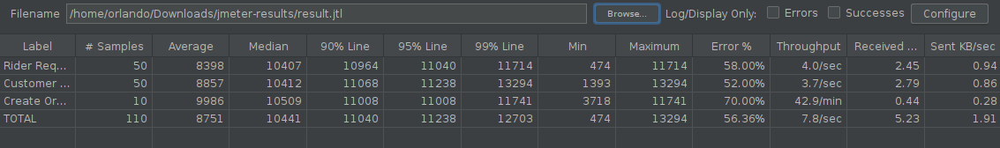

# Table of contents
1. [Project Abstract](#introduction)
2. [Team Roles](#team)
3. [Project](#bookmarks) 
    1. [Backlog](#backlog)
    3. [API](#api)
    4. [CI/CD](#ci_cd)
    5. [Code Quality](#quality)
    6. [Production Environment](#prod_env)
    7. [Deployments](#deploy)
4. [Repositories](#reps) 
    1. [We_Deliver-Backend](#weDel-back)
    2. [We_Deliver-Frontend-Rider](#weDel-frider)
    3. [We_Deliver-Frontend-Admin](#weDel-fadmin)
    4. [DrinkUp-Backend](#drink-back)
    5. [DrinkUp-Frontend](#drink-front)

## Project Abstract <a name="introduction"></a>
The *WeDeliver* application is a riders platform with the main objective of providing an infrastructure that allows stores to use it for the deliveries of their products.

The client side application is a drinks store, *DrinkUp*, that delivers their items using the *WeDeliver* platform.


## Team Roles <a name="team"></a>
The team has 5 elements:
- **Rui Fernandes** - Team Leader, Developer
- **Inês Leite** - Product Owner, Developer
- **Orlando Macedo** - QA Engineer, Developer
- **Óscar Fernandez** - QA Engineer, Developer
- **Pedro Marques** - DevOps Master, Developer

## Project <a name="bookmarks"></a>

### Backlog <a name="backlog"></a>
The Backlog management tool we are using is PivotalTracker for the [*WeDeliver* platform](https://www.pivotaltracker.com/n/projects/2500281) and for the [*DrinkUp* platform](https://www.pivotaltracker.com/n/projects/2500453) using Pivotal Workflow, passing through all the stages ("Write stories", "Prioritize stories", "Estimate stories", "Start stories", "Finish and deliver stories", "Test stories", "Accept or reject stories" and "Stories move to the Done panel").

As a reference, we show how the project was developed.


### Code Quality <a name="quality"></a>

#### Coding Style <a name="code-style"></a>
The project is mainly written in Java, Typescript and Flutter. With that in mind, it's important to have a well defined coding style nomenclature, that allows easier reading and mitigation of errors. The coding styles adopted will be shown next.

1. Java code style - Android Open Source Project
    - https://source.android.com/setup/contribute/code-style
2. Typescript code style - Angular coding style
    - https://angular.io/guide/styleguide
3. Flutter code style - Style Guide for Flutter Repo
    - https://github.com/flutter/flutter/wiki/Style-guide-for-Flutter-repo
4. Furthermore, the mobile flutter app was developed using the BlocPattern
    - https://pub.dev/packages/bloc_pattern

#### Static Code Analysis <a name="static-code-analysis"></a>

In regards to static code analysis, we're using SonarCloud.
[SonarCloud Dashbord](https://sonarcloud.io/organizations/tqs-project-1/projects)

Both project metrics are shown immediately. The quality gate used can be verified at [*link*](https://sonarcloud.io/organizations/tqs-project-1/quality_gates/show/44717).

WeDeliver stats.


Quality gate on new code.


Quality gate on overall code.


Note: The DrinkUp project had a problem with the jacoco plugin and it was not possible to resolve it in time. Has a result the project does not show coverage even though it exists.

### Development Workflow <a name="development-workflow"></a>

For code development the github workflow was used. To that end, all development was committed to the dev branch. Each new feature worked had to necessarily take the code that existed in the dev branch at that time. When all development was complete, a pull request was made to the release branch. At this time the application was released with version v1.0.0. Finally a merge with main, in order to update the main branch of the repository in conformity with the released branch. 

#### Naming branches <a name="naming-branches"></a>

The development and bug branches had to follow a specific nomenclature of names. This is due to the use of pivotal tracker to manage the backlog and the use of github actions for CI/CD.

1. feature branches -- \<UserStoryID\>-feature-\<BranchName\>
2. bug branches -- \<UserStoryID\>-bug-\<BranchName\>

Using this nomenclature it's possible for the pivotal tracker to automate the beginning and delivery processes of User stories. This way of creating branches also allows for a better framing of the branches that must be the target of integration (CI) and deployment (CD) tests, but in a moment this subject will be portrayed.

#### Code review <a name="code-review"></a>

To submit a new feature it was necessary to create a pull request from the branch where the feature was developed for the dev branch. This pull request should be well documented. Merging with the dev branch would only take place if the new code successfully passed all CI rules. Not only that, the code should also be reviewed by at least one other project member. Being merged if all these conditions were met.

The moment the functionality branch is merged with the dev branch, the User Story is considered delivered.

A Pull Request example:


As was said preveously, for the pull request to be accepted it had to go through the CI metrics, namely the static code analysis, and then it would also have to be accepted by at least one more member of the team.

When necessary, members were encouraged to leave comments to the pull request.

With everything in compliance, the merge of the branch is carried out.


Finally, the code for the new feature is deployed when there is a push triggered by merge with the dev branch. When the push is done, the CI pipeline is rerun and then the CD pipeline is run as well.
Build resulting of the push.


Notice the step of Deployment to google cloud.

### CI/CD <a name="ci_cd"></a>

In order to continually test our code and our deployments, each backend and frontend related repositories have CI/CD scripts executed on new code.

#### WeDeliver Spring-Boot Backend <a name="WeDeliver-backend"></a>

Firstly, lets check the continous integration pipeline.
```yaml
      - name: Build and analyze
        env:
          GITHUB_TOKEN: ${{ secrets.GITHUB_TOKEN }}  # Needed to get PR information, if any
          SONAR_TOKEN: ${{ secrets.SONAR_TOKEN }}
        run: mvn -B verify -P all-tests --file webmarket/pom.xml org.sonarsource.scanner.maven:sonar-maven-plugin:sonar
```
This yaml configuration runs all the unit and integration tests and sends the statistics like code coverage to sonarcloud.

---

Moving on to the deployment part, this yaml configuration is used to deploy the code to google app engine service.
```yaml
      - name: Deploy to App Engine (Google Cloud)
        uses: google-github-actions/deploy-appengine@v0.2.0
        with:
          deliverables: webmarket/app.yaml
          project_id: ${{ secrets.GCP_PROJECT }}
          credentials: ${{ secrets.GCP_SA_KEY }}
          promote: false
          version: v1
```

---
Lastly, when there is a release, the following jmeter configuration checks the load the application can handle.
```yaml
on:
  push:
    branches:
      - release
...
      - name: PerfAction for JMeter
        uses: QAInsights/PerfAction@2.0

        with:
          test-plan-path: ./jmeterTests/Release_v1_0_0.jmx
          args: ""
      - name: Upload Results
        uses: actions/upload-artifact@v2
        with:
          name: jmeter-results
          path: result.jtl
```
This actions retrieves an artifact that we can analyse.

Note: the jmeter metrics for this project will be analysed further.

This files can be found at [link](https://github.com/Tqs-project/We_Deliver-Backend/tree/main/.github/workflows).

#### WeDeliver Angular Frontend <a name="WeDeliver-frontend-admin"></a>

The angular application was also tested in order to verify that all components were created properly, thus avoiding future errors.

```yaml
     - name: Setup
       run: npm ci

     - name: Test
       run: |
         npm test -- --no-watch --no-progress --browsers=ChromeHeadlessCI
```

Deployment was handled by the heroku platform. This deployment was active whenever a push to the dev branch was made.


The yaml file can be found at [link](https://github.com/Tqs-project/We_Deliver-Frontend-Admin/blob/main/.github/workflows/build_ci.yml).

#### WeDeliver Rider Mobile App <a name="WeDeliver-rider-mob"></a>

The mobile rider application also used a CI pipeline to verify the integrity of the code.

Yaml configuration to make static code analysis to the flutter application.
```yaml
    - run: flutter analyze .
      working-directory: ${{env.working-directory}}
```

Run widget tests
```yaml
    - run: flutter test --no-sound-null-safety
      working-directory: ${{env.working-directory}}
```

Build apk
```yaml
    - run: flutter build apk --no-sound-null-safety
      working-directory: ${{env.working-directory}}
```

This build can be found at [link](https://github.com/Tqs-project/We_Deliver-MobileApp-Rider/blob/main/.github/workflows/build.yml).


#### DrinkUp Spring-Boot Backend <a name="DrinkUp-backend"></a>

This application deserved the same care as WeDeliver with regard to CI and CD policies.

The pipeline can be found at [link](https://github.com/Tqs-project/DrinkUp-Backend/tree/main/.github/workflows).

#### DrinkUp Angular Frontend <a name="DrinkUp-frontend"></a>

For this application it was only possible to configure deployment policies.



### Workload Test

As mentioned before, there is a github workflow that, when a release is made, checks what load the application can handle. The results of this test will be presented below.


These tests were not very encouraging as there were a lot of errors. These errors are largely due to concurrency issues with simultaneous access to the database.

In the first request we tested the endpoint that allows a rider to check if it has a deliver assigned to him or not. This endpoint turned out to be quite problematic as expected because the number of requests was very high. The test was configured to have 50 requests within two seconds. Which makes a good response by the server immensely difficult.

Simultaneously, an endpoint that returned information about a customer was tested again with 50 users. This endpoint had the fewest errors due to being the endpoint with the least associated logic.

Finally, the server was still being overloaded with the need to create 10 orders in 2 seconds. In this case, requests with errors were around 70%.

These results indicate that to support around 110 simultaneous requests for several endpoints, it would be necessary to increase not only the computational power but also to find a better solution to manage large number of requests. Perhaps in this context it would make sense to use an event queue, which would allow a more organized response to requests.

### Software Testing <a name="software-testing"></a>

With regard to the tests themselves, they were divided into several levels, depending also on the aspects that had to be tested. These levels are listed below.

1. At the data model level, we used tests with @DataJpaTest that allow the tests of custom queries and the integrity of the data model in general

2. At the service level, simple unit tests, mocking all the dependencies. This permits the verification of all the logic associated with the specific service.

3. At the rest controller level, first using @WebMvcTest. This tool was used with the purpose of mocking service dependencies that allows the verification of the controller logic. This tool also permits the verification of the endpoint parsing.

4. Again at the rest controller level, using @SpringBootTest and @TestPropertySource to test the endpoints with all the associated logic. The database used was also the database for production.

5. Lastly, all data transfer objects and util methods were tested to mitigate unnecessary errors.

#### Functional testing/acceptance <a name="functional-testing"></a>

Functional testing was done using the black box methodology. This means that the functionalities must receive a certain input and its output was tested in order to verify if it corresponds to what was expected or not.

#### Unit tests <a name="unit-tests"></a>

Unit tests followed an open box methodology where all intrinsic logic was tested. It was important to check for example that method calls were done correctly and in the correct order. For this, mocking modules was imperial and was done whenever possible.

#### System and integration testing <a name="system-integration-test"></a>

For system and integration tests, the two test methodologies, open box and closed box, were used. Closed box allowed us to check inputs and outputs and open box allowed us to check the solidity of the internal logic.

### Deployments <a name="deploy"></a>
Our App was Continuously deployed into the GoogleCloud Platform and Heroku Platform.

#### APIs <a name="api"></a>
We have 2 sets of API's, one for *WeDeliver* and another for *DrinkUp*.

[Swagger for *WeDeliver*](https://webmarket-314811.oa.r.appspot.com/swagger-ui/index.html?configUrl=%2Fapi-docs%2Fswagger-config#/)

[Swagger for *DrinkUp*](http://drinkup-316817.oa.r.appspot.com/swagger-ui/index.html?configUrl=/api-docs/swagger-config)

#### Frontend deployments

The *WeDeliver* admin frontend is deployed on [https://wedeliveradmin.herokuapp.com/](https://wedeliveradmin.herokuapp.com/).

*DrinkUp* client frontend is on [https://drinkupstore.herokuapp.com/](https://drinkupstore.herokuapp.com/).

The *WeDeliver* rider app has an apk on this repo.

**Existing users:**
- Clients for *DrinkUp*:
    -  username: aux | password: aux
    -  can create a new user without any problem
-  Riders for *WeDeliver*:
    -  username: Pedro | password: 1234
    -  username: Maria | password: 1234

### Current WeDeliver functionalities

1. Customer
    - Create customer
    - Make order
    - Check order status
    - Verify price of a delivery
    - Login
    - Update information about himself

2. Rider
    - Create rider
    - Verify if order was assigned to him
    - Accept order
    - Decline order
    - Deliver order
    - Update location
3. Admin
    - Check waiting queue of orders
    - Check current assignments
    - Get orders, riders and customers information
    - Login and Logout

## Repositories <a name="reps"></a>
This project has two main applications: *WeDeliver* and *DrinkUp*. Each of them has a backend and a frontend. *WeDeliver* has two frontends, the riders application, which is in Flutter, and the admin application, which is in AngularJS. The *DrinkUp* frontend is also in AngularJS.

Giving that the project has several parts, we separated them by the following repositories:

### We_Deliver-Backend <a name="weDel-back"></a>
Has all the deliveries platform, *WeDeliver*, backend: the tables' models, it's repositories, the services and controllers for the API's and the tests for each.

Repo link: [here](https://github.com/Tqs-project/We_Deliver-Backend)

### We_Deliver-Frontend-Rider <a name="weDel-frider"></a>
Has the code for the Flutter app of the *WeDeliver* platform for the Riders. 

Repo link: [here](https://github.com/Tqs-project/We_Deliver-Frontend-Rider)

### We_Deliver-Frontend-Admin <a name="weDel-fadmin"></a>
Has the code for the AngularJS application of the *WeDeliver* platform for the admin.

Repo link: [here](https://github.com/Tqs-project/We_Deliver-MobileApp-Rider)

### DrinkUp-Backend <a name="drink-back"></a>
Has the code for the backtend of the *DrinkUp* store: the tables' models, it's repositories, the services and controllers for the API's and the tests for each.

Repo link: [here](https://github.com/Tqs-project/DrinkUp-Backend)

### DrinkUp-Frontend <a name="drink-front"></a>
Has the code for the frontend of the *DrinkUp* store.

Repo link: [here](https://github.com/Tqs-project/DrinkUp-Frontend)
