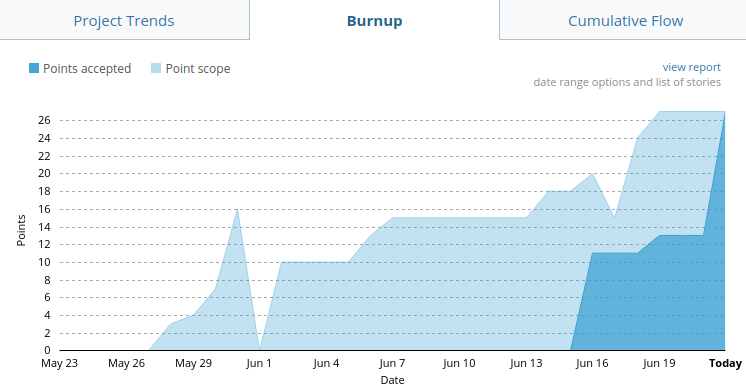
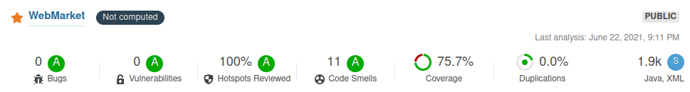
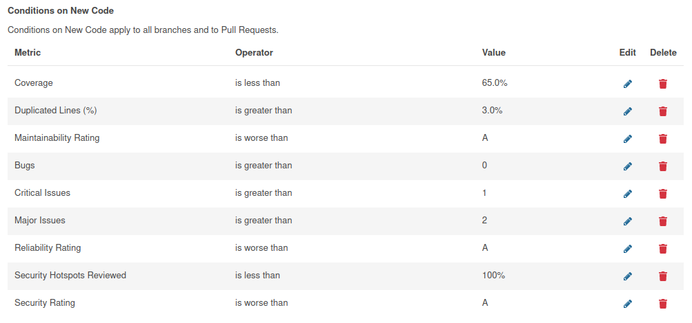
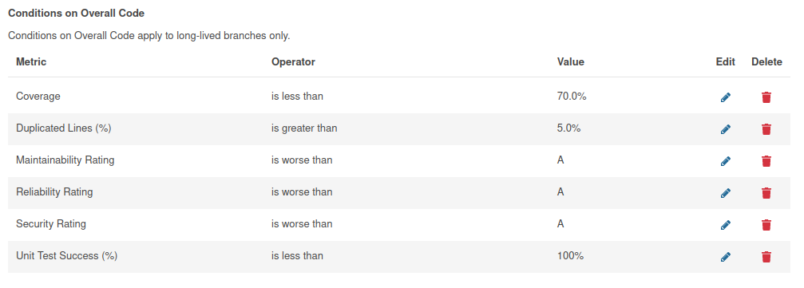
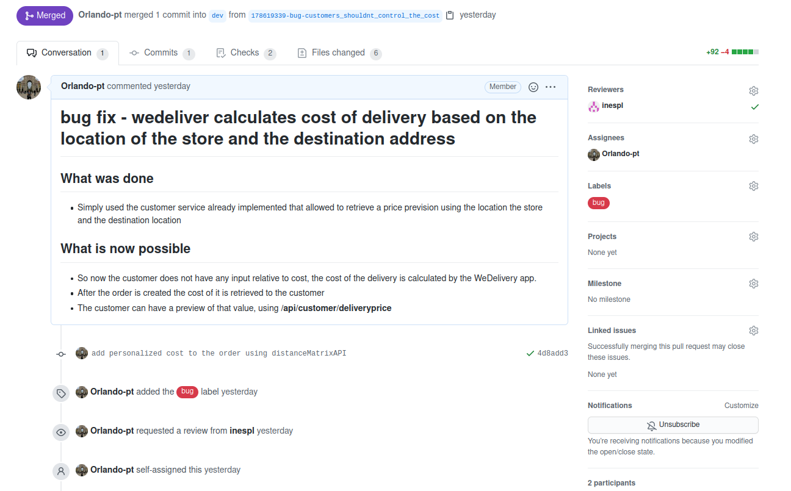
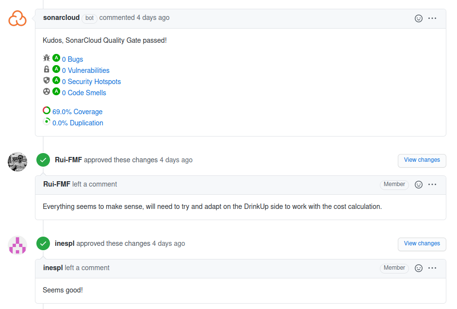
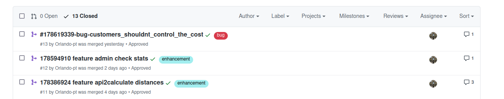
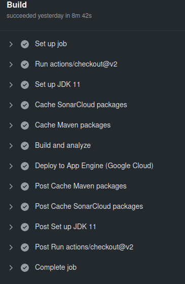

# Table of contents
1. [Project Abstract](#introduction)
2. [Team Roles](#team)
3. [Project](#bookmarks) 
    1. [Backlog](#backlog)
    3. [API](#api)
    4. [CI/CD](#ci_cd)
    5. [Code Quality](#quality)
    6. [Production Environment](#prod_env)
    7. [Deployments](#deploy)
4. [Repositories](#reps) 
    1. [We_Deliver-Backend](#weDel-back)
    2. [We_Deliver-Frontend-Rider](#weDel-frider)
    3. [We_Deliver-Frontend-Admin](#weDel-fadmin)
    4. [DrinkUp-Backend](#drink-back)
    5. [DrinkUp-Frontend](#drink-front)

## Project Abstract 
The *WeDeliver* application is a riders platform with the main objective of providing an infrastructure that allows stores to use it for the deliveries of their products.

The client side application is a drinks store, *DrinkUp*, that delivers their items using the *WeDeliver* platform.

## Team Roles 
The team has 5 elements:
- **Rui Fernandes** - Team Leader, Developer
- **Inês Leite** - Product Owner, Developer
- **Orlando Macedo** - QA Engineer, Developer
- **Óscar Fernandez** - QA Engineer, Developer
- **Pedro Marques** - DevOps Master, Developer

## Project 

### Backlog 
The Backlog management tool we are using is PivotalTracker for the [*WeDeliver* platform](https://www.pivotaltracker.com/n/projects/2500281) and for the [*DrinkUp* platform](https://www.pivotaltracker.com/n/projects/2500453) using Pivotal Workflow, passing through all the stages ("Write stories", "Prioritize stories", "Estimate stories", "Start stories", "Finish and deliver stories", "Test stories", "Accept or reject stories" and "Stories move to the Done panel").

As a reference, we show how the project was developed.

### Code Quality 

#### Coding Style
The project is mainly written in Java, Typescript and Flutter. With that in mind, it's important to have a well defined coding style nomenclature, that allows easier reading and mitigation of errors. The coding styles adopted will be shown next.

1. Java code style - Android Open Source Project
    - https://source.android.com/setup/contribute/code-style
2. Typescript code style - Angular coding style
    - https://angular.io/guide/styleguide
3. Flutter code style - Style Guide for Flutter Repo
    - https://github.com/flutter/flutter/wiki/Style-guide-for-Flutter-repo
4. Furthermore, the mobile flutter app was developed using the BlocPattern
    - https://pub.dev/packages/bloc_pattern

#### Static Code Analysis

In regards to static code analysis, we're using SonarCloud.
[SonarCloud Dashbord](https://sonarcloud.io/organizations/tqs-project-1/projects)

Both project metrics are shown immediately. The quality gate used can be verified at [*link*](https://sonarcloud.io/organizations/tqs-project-1/quality_gates/show/44717).

WeDeliver stats.

Quality gate on new code.

Quality gate on overall code.

Note: The DrinkUp project had a problem with the jacoco plugin and it was not possible to resolve it in time. Has a result the project does not show coverage even though it exists.

### Development Workflow

For code development the github workflow was used. To that end, all development was committed to the dev branch. Each new feature worked had to necessarily take the code that existed in the dev branch at that time. When all development was complete, a pull request was made to the release branch. At this time the application was released with version v1.0.0. Finally a merge with main, in order to update the main branch of the repository in conformity with the released branch. 

#### Naming branches

The development and bug branches had to follow a specific nomenclature of names. This is due to the use of pivotal tracker to manage the backlog and the use of github actions for CI/CD.

1. feature branches -- \<UserStoryID\>-feature-\<BranchName\>
2. bug branches -- \<UserStoryID\>-bug-\<BranchName\>

Using this nomenclature it's possible for the pivotal tracker to automate the beginning and delivery processes of User stories. This way of creating branches also allows for a better framing of the branches that must be the target of integration (CI) and deployment (CD) tests, but in a moment this subject will be portrayed.

#### Code review

To submit a new feature it was necessary to create a pull request from the branch where the feature was developed for the dev branch. This pull request should be well documented. Merging with the dev branch would only take place if the new code successfully passed all CI rules. Not only that, the code should also be reviewed by at least one other project member. Being merged if all these conditions were met.

The moment the functionality branch is merged with the dev branch, the User Story is considered delivered.

A Pull Request example:

As was said preveously, for the pull request to be accepted it had to go through the CI metrics, namely the static code analysis, and then it would also have to be accepted by at least one more member of the team.

Where necessary, members were encouraged to leave comments to the pull request.

With everything in compliance, the merge of the branch is carried out.

Finally, the code for the new feature is deployed when there is a push triggered by merge with the dev branch. When the push is done, the CI pipeline is rerun and then the CD pipeline is run as well.
Build resulting of the push.

Notice the step of Deployment to google cloud.

### CI/CD 
In order to continually test our deployments, each backend-related repositories for both WeDeliver and DrinkUp apps have CI/CD scripts executed on push.  

*WeDeliver* Backend
[CD](https://github.com/Tqs-project/We_Deliver-Backend/blob/dev/.github/workflows/build-cd.yaml)
[CI](https://github.com/Tqs-project/We_Deliver-Backend/blob/dev/.github/workflows/build-ci.yml)

*DrinkUp* Backend
[CD](https://github.com/Tqs-project/DrinkUp-Backend/blob/main/.github/workflows/build-cd.yaml)
[CI](https://github.com/Tqs-project/DrinkUp-Backend/blob/main/.github/workflows/build-ci.yml)

Furthermore, the rider flutter app repository also has a CI script.
*WeDeliver* MobileApp
[CI](https://github.com/Tqs-project/We_Deliver-MobileApp-Rider/blob/dev/.github/workflows/build.yml)

### API 
We have 2 sets of API's, one for *WeDeliver* and another for *DrinkUp*. The first one has 4 groups of API's, for the customer and riders and for the orders and admin page. *DrinkUp* has 3 groups of API's for the users, the items and the orders.

[Swagger for *WeDeliver*](https://webmarket-314811.oa.r.appspot.com/swagger-ui/index.html?configUrl=%2Fapi-docs%2Fswagger-config#/)

[Swagger for *DrinkUp*](http://drinkup-316817.oa.r.appspot.com/swagger-ui/index.html?configUrl=/api-docs/swagger-config)

### Production Environment 

### Deployments 
Our App is Continuously being deployed into the GoogleCloud Platform.

The *WeDeliver* admin frontend is deployed on **[https://wedeliveradmin.herokuapp.com/](https://wedeliveradmin.herokuapp.com/)** and *DrinkUp* client frontend is on **[https://drinkupstore.herokuapp.com/](https://drinkupstore.herokuapp.com/)**. Both were deployed with Heroku.

The *WeDeliver* rider app has an apk on this repo.

**Existing users:**
- Clients for *DrinkUp*:
    -  username: aux | password: aux
-  Riders for *WeDeliver*:
    -  username: Pedro | password: 1234

## Repositories 
This project has two main applications: *WeDeliver* and *DrinkUp*. Each of them has a backend and a frontend. *WeDeliver* has two frontends, the riders application, which is in Flutter, and the admin application, which is in AngularJS. The *DrinkUp* frontend is also in AngularJS.

Giving that the project has several parts, we separated them by the following repositories:

### We_Deliver-Backend 
Has all the deliveries platform, *WeDeliver*, backend: the tables' models, it's repositories, the services and controllers for the API's and the tests for each.

Repo link: [here](https://github.com/Tqs-project/We_Deliver-Backend)

### We_Deliver-Frontend-Rider 
Has the code for the Flutter app of the *WeDeliver* platform for the Riders. 

Repo link: [here](https://github.com/Tqs-project/We_Deliver-Frontend-Rider)

### We_Deliver-Frontend-Admin 
Has the code for the AngularJS application of the *WeDeliver* platform for the admin.

Repo link: [here](https://github.com/Tqs-project/We_Deliver-MobileApp-Rider)

### DrinkUp-Backend 
Has the code for the backtend of the *DrinkUp* store: the tables' models, it's repositories, the services and controllers for the API's and the tests for each.

Repo link: [here](https://github.com/Tqs-project/DrinkUp-Backend)

### DrinkUp-Frontend 
Has the code for the frontend of the *DrinkUp* store.

Repo link: [here](https://github.com/Tqs-project/DrinkUp-Frontend)
